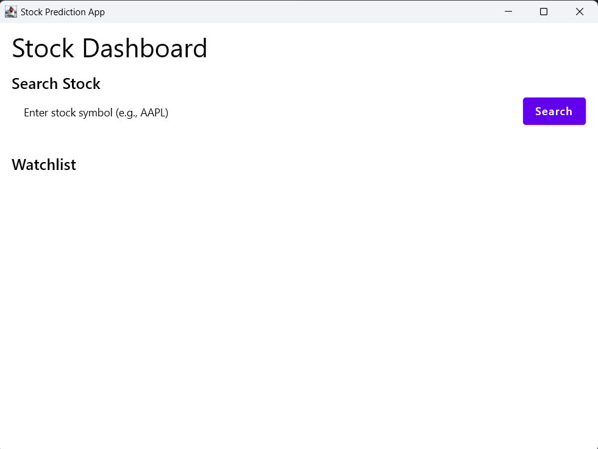

# Stock Prediction Application 📈

A **Kotlin Compose Desktop Application** designed for stock enthusiasts and financial analysts. This application allows users to search for stocks, monitor their real-time prices, and make calculations based on future projections.

**🚧 Work in Progress**  
This project is currently under development, and new features are being actively added. Contributions are highly welcome to help take this project to the next level!

---

## Features 🚀

- **Search for Stocks**: Search for stock information using live data fetched from Yahoo Finance.
- **Watchlist**: Add stocks to a real-time watchlist for instant tracking.
- **Real-Time Data**: Display current stock prices with live updates.
- **Projection Tools**: Calculate potential returns based on projected stock performance.
- **Offline Mode**: Local mapping of stock tickers with company names for faster lookup and reduced API dependency.

---

## Screenshots 📸

### Dashboard Screen


## Technology Stack 🛠️

- **Kotlin Compose Desktop**: For a modern and responsive desktop UI.
- **Ktor**: Lightweight HTTP client for API requests.
- **org.json**: For JSON parsing.
- **Gradle**: Build and dependency management.
- **Yahoo Finance API**: Fetch real-time stock market data.

---

## Installation 🖥️

### Prerequisites

1. **JDK 17 or higher**: Ensure you have the appropriate Java Development Kit installed.
2. **Gradle**: Install Gradle for building the project.
3. **Internet Connection**: Required for live stock data fetching.

### Steps to Run

1. Clone this repository:

   ```bash
   git clone https://github.com/yourusername/stock-prediction-app.git
   cd stock-prediction-app
   ```

2. Build the project:

   ```bash
   ./gradlew build
   ```

3. Run the application:

   ```bash
   ./gradlew run
   ```

4. Enjoy tracking and projecting stocks! 🎉

---

## Configuration ⚙️

### API Key

This application uses the **Yahoo Finance API** for live data. You need an API key to fetch stock details.

1. Create a file `config.properties` in the `resources` directory:

   ```properties
   API_KEY=your_api_key_here
   ```

2. Replace `your_api_key_here` with your Yahoo Finance API key.

### Local Stock Ticker Data

Stock ticker mapping is stored in `output.json` in the `resources` directory. Add or update the JSON file as needed.

Sample `output.json`:

```json
{
  "AAPL": "Apple Inc.",
  "GOOG": "Alphabet Inc.",
  "AMZN": "Amazon.com Inc."
}
```

---

## Project Structure 📂

```
src/
├── main/
│   ├── kotlin/
│   │   ├── ui/             # UI components (Dashboard, Watchlist)
│   │   ├── data/           # Networking (API calls, models)
│   │   ├── utils/          # Utility functions and helpers
│   │   └── Main.kt         # Application entry point
│   └── resources/
│       ├── output.json     # Stock ticker to company mapping
│       └── config.properties # API Key configuration
```

---

## Contribution Guidelines 🤝

This is a **work-in-progress** project, and we welcome all contributors to take it forward by:

- Adding new features (e.g., advanced analytics, historical data charts).
- Fixing bugs or improving code quality.
- Enhancing the user interface.

### Steps to Contribute

1. Fork the repository.
2. Create a feature branch:
   ```bash
   git checkout -b feature/your-feature-name
   ```
3. Commit your changes:
   ```bash
   git commit -m "Add your feature description"
   ```
4. Push the branch:
   ```bash
   git push origin feature/your-feature-name
   ```
5. Open a Pull Request.

---

## License 📜

This project is licensed under the **MIT License**. See the `LICENSE` file for details.

---

## Acknowledgments 🙏

- **Kotlin Community**: For providing a robust and flexible programming language.
- **Yahoo Finance API**: For real-time stock market data.
- **Compose Desktop Team**: For an incredible desktop UI framework.

---

## Contact 📧

If you have any questions or feedback, feel free to reach out:

- **Email**: vrk1990@outlook.com
- **GitHub**: [spkdroid](https://github.com/spkdroid)

---

Feel free to contribute and make this project even better! 😊

--- 
